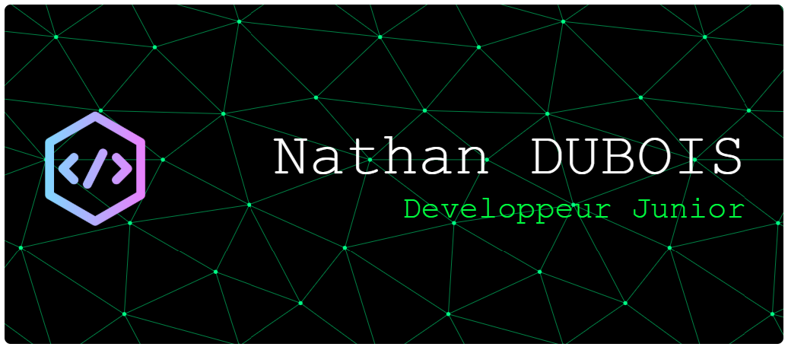

## 👋 Salut, moi c’est Nathan Dubois

🎓 Étudiant en **BTS SIO option SLAM**  
💼 **Développeur RPA en alternance** à la DGFIP  
🎯 Objectif : poursuivre en **Licence Informatique**

---

### 💻 Stack & compétences techniques
- **Langages** : C, C#, Java, PHP  
- **Frameworks / UI** : WPF, React, Bootstrap, Tailwind  
- **Web** : HTML, CSS, JavaScript  
- **Base de données** : SQL (MCD, MLD)  
- **Outils** : Git, GitHub, GitLab  
- **Méthodes** : UML, cycle en V, Agile  
- **Autres** : UiPath (RPA), notions RGPD, développement sécurisé

---

### 🏗️ Expérience
**Développeur RPA – DGFIP**  
📍 Alternance – depuis septembre 2024 / En cours 
- Développement de robots UiPath  
- Automatisation de processus métiers  
- Optimisation des performances et réduction des erreurs humaines  

---

### 🏸 À propos
- Badminton en compétition depuis l’enfance  
- GEO niveau 2 (organisation de compétitions)

---

### 📫 Me contacter
- GitHub : https://github.com/nathan-5349  
- LinkedIn : https://www.linkedin.com/in/nathan-dubois-602026382  
- Portfolio : https://nathandubois.vercel.app

